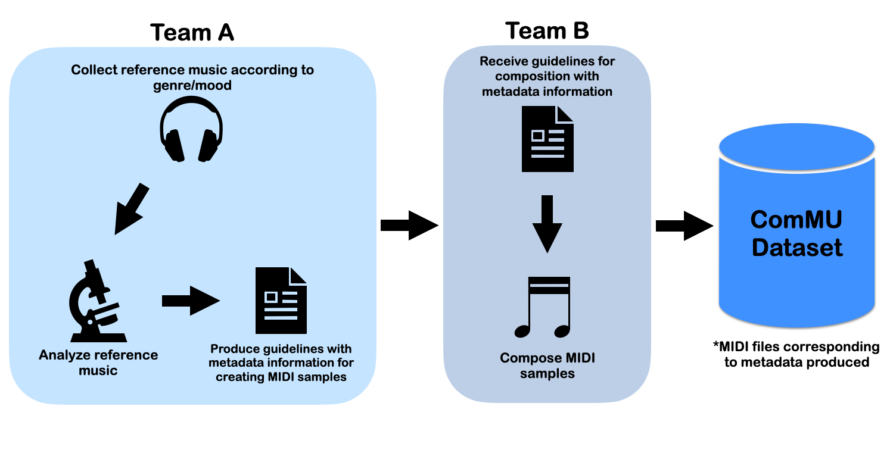
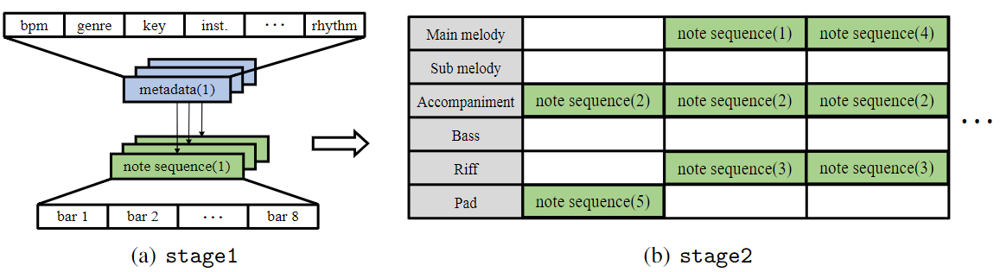
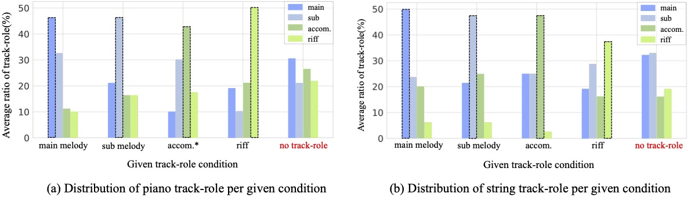

# ComMU

- <a href="https://github.com/POZAlabs/ComMU-code">Paper on arxiv(not yet available)</a>
- <a href="https://github.com/POZAlabs/ComMU-code">Code on github</a>
- <a href="./assets/ComMU.tar" download="ComMU.tar">Dataset download</a>
 

<iframe width="800" height="457" src="https://www.youtube.com/embed/yXFlF9nlB8Y" title="YouTube video player" frameborder="0" allow="accelerometer; autoplay; clipboard-write; encrypted-media; gyroscope; picture-in-picture" allowfullscreen></iframe>    

ComMU is a dataset for combinatorial music generation, a branch of conditional music generation. The dataset contains 11,144 MIDI samples written and created by professional composers, and is consisted of short note sequences of 4, 8, or 16 bars. MIDI files of the dataset are organized into 12 different metadata. Here are the following metadata and more information on the dataset:
BPM, Genre, Key, Track-instrument, Track-role, Time signature, Pitch range, Number of Measures, Chord progression, Min Velocity, Max Velocity, Rhythm

## Example of the dataset

- #bpm: 100, #key: C major, #time_signature: 4/4 #number_of_measures: 8, #genre: cinematic, #rhythm: standard #track_category: accompaniment, #pitch_range: mid_low, #instruments: piano, #min_velocity: 36, #max_velocity: 40
#chord_progression: F - C - Am - G
<audio controls style="width: 400px;">
  <source src="./assets/example_data/1.wav" type="audio/mpeg">
</audio>

- #bpm: 120, #key: A minor, #time_signature: 3/4 #number_of_measures: 16, #genre: cinematic, #rhythm: standard #track_category: main_melody, #pitch_range: mid_high, #instruments: string, #min_velocity: 70, #max_velocity: 70
#chord_progression: Am - Em7 - FM7 - Em7 - Dm7 - CM7 - Bm7(b5) - E7 - Am - Em7 - FM7 - Em7 - Dm7 - CM7 - Bm7(b5) - E1 - Am
<audio controls style="width: 400px;">
  <source src="./assets/example_data/2.wav" type="audio/mpeg">
</audio>

## Pipeline of data collection

  

## Combinatorial music generation

  

As shown above, the process of combinatorial music generation is divided into two stages. In stage 1, a note sequence is generated from a set of metadata. In stage 2, those note sequences are combined to produce a complete piece of music. Hence ComMU is utilized to tackle its task in stage 1.

### Stage 1

 - Audio samples below are automatically generated with our model.
 - Common metadata underlying the 5 clips are as follows:
      -  #bpm: 130, #key: A minor, #time_signature: 4/4
      -  #number_of_measures: 8, #genre: new age, #rhythm: standard
      -  #chord_progression: Am → F → C → G → A m → F → C → G  

 - #track_category: accompaniment, #pitch_range: mid_low, #instruments: piano, #min_velocity: 40, #max_velocity: 50
<audio controls style="width: 400px;">
  <source src="./assets/audio_samples/track_role/newage_trackrole/newage_accompaniment_1.mp3" type="audio/mpeg">
</audio>

   - #track_category: main_melody, #pitch_range: mid, #instruments: piano, #min_velocity: 60, #max_velocity: 70
<audio controls style="width: 400px;">
  <source src="./assets/audio_samples/track_role/newage_trackrole/newage_mainmelody_1.mp3" type="audio/mpeg">
</audio>

   - #track_category: pad, #pitch_range: mid_low, #instruments: piano, #min_velocity: 70, #max_velocity: 80
<audio controls style="width: 400px;">
  <source src="./assets/audio_samples/track_role/newage_trackrole/newage_pad_piano_1.mp3" type="audio/mpeg">
</audio>

   - #track_category: pad, #pitch_range: mid_low, #instruments: string, #min_velocity: 2, #max_velocity: 127
<audio controls style="width: 400px;">
  <source src="./assets/audio_samples/track_role/newage_trackrole/newage_pad_string_1.mp3" type="audio/mpeg">
</audio>

   - #track_category: riff, #pitch_range: mid_high, #instruments: piano, #min_velocity: 70, #max_velocity: 80
<audio controls style="width: 400px;">
  <source src="./assets/audio_samples/track_role/newage_trackrole/newage_riff_1.mp3" type="audio/mpeg">
</audio>

## Generated music (stage 2)

 - The full audio sample below is generated by combining the 5 audio samples above. This is stage 2 of the combinatorial music generation. A human composer allocated the audio clips, putting only 3-4 minutes of work to create the full song. 

<audio controls style="width: 600px;">
  <source src="./assets/audio_samples/track_role/newage_trackrole/newage_inspiring.mp3" type="audio/mpeg">
</audio>

## Ground truth vs. Generated

<table class="audio-table">
  <tbody>
    <tr>
      <td>Ground truth</td>
      <td>Generated</td>
    </tr>
    <tr>
      <td><audio controls=""><source src="./assets/comparing/ground_truth/1.wav" type="audio/mpeg" /></audio></td>
      <td><audio controls=""><source src="./assets/comparing/generated/1.wav" type="audio/mpeg" /></audio></td>
    </tr>
    <tr>
      <td><audio controls=""><source src="./assets/comparing/ground_truth/2.wav" type="audio/mpeg" /></audio></td>
      <td><audio controls=""><source src="./assets/comparing/generated/2.wav" type="audio/mpeg" /></audio></td>
    </tr>
    <tr>
      <td><audio controls=""><source src="./assets/comparing/ground_truth/3.wav" type="audio/mpeg" /></audio></td>
      <td><audio controls=""><source src="./assets/comparing/generated/3.wav" type="audio/mpeg" /></audio></td>
    </tr>
    <tr>
      <td><audio controls=""><source src="./assets/comparing/ground_truth/4.wav" type="audio/mpeg" /></audio></td>
      <td><audio controls=""><source src="./assets/comparing/generated/4.wav" type="audio/mpeg" /></audio></td>
    </tr>
    <tr>
      <td><audio controls=""><source src="./assets/comparing/ground_truth/5.wav" type="audio/mpeg" /></audio></td>
      <td><audio controls=""><source src="./assets/comparing/generated/5.wav" type="audio/mpeg" /></audio></td>
    </tr>
  </tbody>
  <tfoot>
   <tr>
      <td><audio controls=""><source src="./assets/comparing/ground_truth/6.wav" type="audio/mpeg" /></audio></td>
      <td><audio controls=""><source src="./assets/comparing/generated/6.wav" type="audio/mpeg" /></audio></td>
    </tr>
  </tfoot>
</table>

## Multi-track with Track-role

  

 - Figure above shows that with the introduction of track-role, a more appropriate music can be generated and can improve the capacity and flexibility of automatic composition.

<h3>Piano with 4 track-role</h3>
All metadata are the same except for track-role

<table class="audio-table">
  <tbody>
    <tr>
      <td>Main Melody</td>
      <td><audio controls=""><source src="./assets/audio_samples/track_role/piano/piano_mainmelody/piano_mainmelody_000.mp3" type="audio/mpeg" /></audio></td>
      <td><audio controls=""><source src="./assets/audio_samples/track_role/piano/piano_mainmelody/piano_mainmelody_002.mp3" type="audio/mpeg" /></audio></td>
    </tr>
    <tr>
      <td>Sub Melody</td>
      <td><audio controls=""><source src="./assets/audio_samples/track_role/piano/piano_submelody/piano_submelody_000.mp3" type="audio/mpeg" /></audio></td>
      <td><audio controls=""><source src="./assets/audio_samples/track_role/piano/piano_submelody/piano_submelody_002.mp3" type="audio/mpeg" /></audio></td>
    </tr>
    <tr>
      <td>Accompaniment</td>
      <td><audio controls=""><source src="./assets/audio_samples/track_role/piano/piano_accompaniment/piano_accompaniment_001.mp3" type="audio/mpeg" /></audio></td>
      <td><audio controls=""><source src="./assets/audio_samples/track_role/piano/piano_accompaniment/piano_accompaniment_003.mp3" type="audio/mpeg" /></audio></td>
    </tr>
  </tbody>
  <tfoot>
    <tr>
      <td>Riff</td>
      <td><audio controls=""><source src="./assets/audio_samples/track_role/piano/piano_riff/piano_riff_002.mp3" type="audio/mpeg" /></audio></td>
      <td><audio controls=""><source src="./assets/audio_samples/track_role/piano/piano_riff/piano_riff_003.mp3" type="audio/mpeg" /></audio></td>
    </tr>
  </tfoot>
</table>

<h3>String with 4 track-role</h3>
All metadata are the same except for track-role

<table class="audio-table">
  <tbody>
    <tr>
      <td>Main Melody</td>
      <td><audio controls=""><source src="./assets/audio_samples/track_role/string/string_mainmelody/string_mainmelody_001.mp3" type="audio/mpeg" /></audio></td>
      <td><audio controls=""><source src="./assets/audio_samples/track_role/string/string_mainmelody/string_mainmelody_003.mp3" type="audio/mpeg" /></audio></td>
    </tr>
    <tr>
      <td>Sub Melody</td>
      <td><audio controls=""><source src="./assets/audio_samples/track_role/string/string_submelody/string_submelody_001.mp3" type="audio/mpeg" /></audio></td>
      <td><audio controls=""><source src="./assets/audio_samples/track_role/string/string_submelody/string_submelody_002.mp3" type="audio/mpeg" /></audio></td>
    </tr>
    <tr>
      <td>Accompaniment</td>
      <td><audio controls=""><source src="./assets/audio_samples/track_role/string/string_accompaniment/string_accompaniment_002.mp3" type="audio/mpeg" /></audio></td>
      <td><audio controls=""><source src="./assets/audio_samples/track_role/string/string_accompaniment/string_accompaniment_003.mp3" type="audio/mpeg" /></audio></td>
    </tr>
  </tbody>
  <tfoot>
    <tr>
      <td>Riff</td>
      <td><audio controls=""><source src="./assets/audio_samples/track_role/string/string_riff/string_riff_001.mp3" type="audio/mpeg" /></audio></td>
      <td><audio controls=""><source src="./assets/audio_samples/track_role/string/string_riff/string_riff_002.mp3" type="audio/mpeg" /></audio></td>
    </tr>
  </tfoot>
</table>

