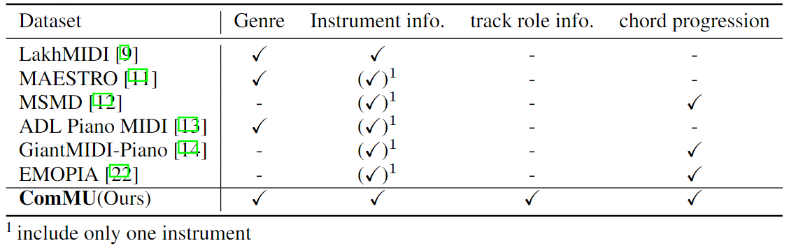
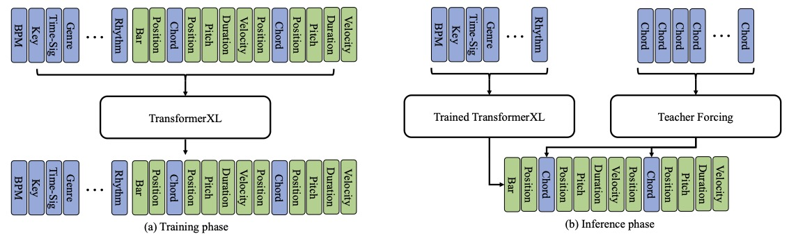
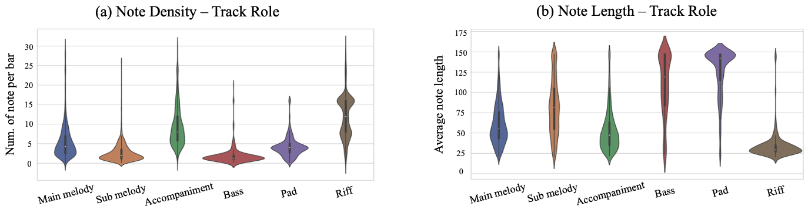
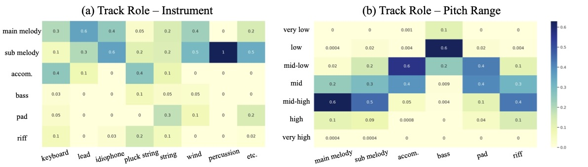
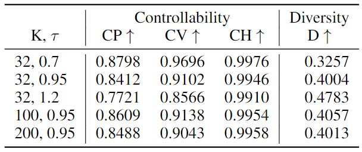
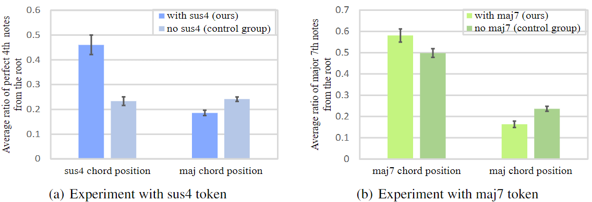

# ComMU

<iframe width="800" height="457" src="https://www.youtube.com/embed/yXFlF9nlB8Y" title="YouTube video player" frameborder="0" allow="accelerometer; autoplay; clipboard-write; encrypted-media; gyroscope; picture-in-picture" allowfullscreen></iframe>    

ComMU is a dataset for combinatorial music generation, a branch of conditional music generation. The dataset contains 12,025 MIDI samples written and created by professional composers, and is consisted of short note sequences of 4, 8, or 16 bars. MIDI files of the dataset are organized into 12 different metadata. Here are the following metadata and more information on the dataset:

1. BPM
2. Genre
3. Key
4. Track instrument
5. Track-role
6. Time signature
7. Pitch range
8. Number of Measures
9. Chord progression
10. Min Velocity
11. Max Velocity
12. Rhythm

## What is different from other Musical metadata?

Unlike any other previous MIDI datasets -- LakhMIDI, MAESTRO, EMOPIA, etc. -- ComMU is the only dataset yet to provide and connect 12 different metadata and introduce track-role as one of its conditions.

  

Above is a comparison of ComMU to different MIDI datasets with various metadata. Because genre, instrument information, track-role information, and chord progression are metadata that must be tagged by human beings, the table compares ComMU to other MIDI datasets on those four types of metadata.

## Example of the Dataset

 - Representation of a ComMU sample is as follows:
    - X = {xM1 , .., xM11 , xS12 , .., xSn }
      - M = 11 metadata excluding chord progression
      - S = note sequence

_sample clips go here_

## Understanding the Task of Combinatorial Music Generation

  

As shown above, the process of combinatorial music generation is divided into two stages. In stage 1, a note sequence is generated from a set of metadata. In stage 2, those note sequences are combined to produce a complete piece of music. Hence ComMU is utilized to tackle its task in stage 1.

  

Shown above is the architecture for combinatorial music generation task. At inference phase, the Transformer-XL model is trained autoregressively with 11 metadata as conditions to create note sequences. During this case, _we forcefully insert chord tokens -- the teacher forcing method to help explicitly input chord progression as a condition._

 - Autoregressive Model:
    - P(xt+1 | x1:t), t ≥ 11

 - After training, we generate diverse note sequences with specific metadata and chord progression as follows:
    - P (xS | xM1:11, C )

## Data Analysis

The distribution in note density and note length, according to track-role, is illustrated below. The shapes of the corresponding notes are dependent on track-role

  

While melody and accompaniment have short note lengths, bass and pad have longer notes. Note density shows that melody and accompaniment hold stronger, denser notes, whereas the bass and pad have a more weak but stable notes.

  

The metadata heat map above illustrates the correlation between instruments, track-role, and pitch range. The map suggests that when a music is generated without track-role information, a piece that is highly correlated with the track-role will be generated. Conversely, without track-role information, a piece with low correlation will most likely not be generated -- meaning lower diversity in the tracks created.

## Objective Metric Result

While it is difficult to define what an objectively high quality piece of music harnesses, we have chosen the following three categories: controllability, and diversity.

1. Controllability
    - Pitch Control(CP): measured by the ratio of notes that meet the given pitch range among all generated note sequences
    - Velocity control(CV): measured by the number of notes within the min/max velocity range
    - Harmony Control(CH): measured by whether the note pitch is within the scale of corresponding audio key

2. Diversity (D): average pairwise distances between different pieces generated from the same metadata, measured using chroma similarity and groove similarity (cosine similarity of pitch class and rhythm between two music)

 - We compare the results from our baseline model(Transformer-XL) in the variation of top-k(K) and temperature(τ).

  

## Extended Chord Quality

  

 - Figure above illustrates that ComMU not only has major, minor, diminished and augmented 7th but also has extended chord qualities such as suspended 4th, major 7th, and minor 7th.

## Multi-track with Track-role

  

 - Figure above shows that with the introduction of track-role, a more appropriate music can be generated and can improve the capacity and flexibility of automatic composition.

_comparing music with various track-role_

## Conclusion

With quantitative evaluation method for combinatorial music generation (fidelity, and controllability), it is clear that there are numerous strengths of ComMU. The results demonstrate that ComMU not only allows creation of quality music that are diverse and appropriate to the required conditions but also improves the capacity and flexibility of automatic composition by introducing professional metadata expression. We are in hopes that combinatorial music generation and ComMU has and will spark a variety of researches to be done.

## Listening sample music

randomly chosen metadata output. All music samples are generated.

_list samples with metadata_

## Listening music after combinatorial music generation stage1 and 2

All music samples are generated. stage2 is done by composers.

_list samples with metadata_

## Authors and Affiliations

 - Lee Hyun
    - Pozalabs
    - hyun@pozalabs.com
 - Taehyun Kim
   - Pozalabs, Yonsei Univ.
   - tayhyun@pozalabs.com
   - kimth0101@yonsei.ac.kr
 - Hyiolim Kang
   - Yonsei Univ.
   - hyolimkang@yonsei.ac.kr
 - Minjoo Ki
   - Yonsei Univ.
   - minjoo@yonsei.ac.kr
 - Hyeonchan Hwang
   - Pozalabs
   - hyeonchan@pozalabs.com
 - Kwanho Park
   - Pozalabs
   - kwanho@pozalabs.com
 - Sharang Han
   - Pozalabs
   - sharang@pozalabs.com
 - Seon Joo Kim
   - Pozalabs, Yonsei Univ.
   - seonjoo@pozalabs.com
   - seonjookim@yonsei.ac.kr
