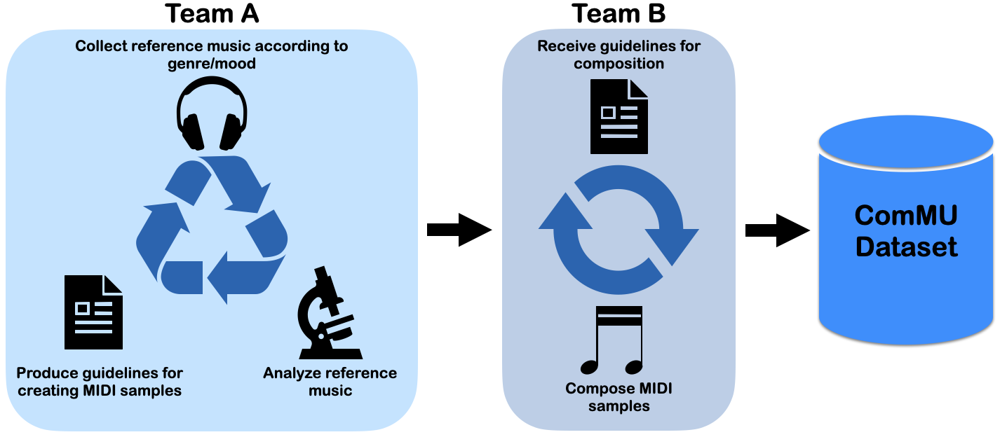

# ComMU

_arxiv link, github code link, dataset download link_

<iframe width="800" height="457" src="https://www.youtube.com/embed/yXFlF9nlB8Y" title="YouTube video player" frameborder="0" allow="accelerometer; autoplay; clipboard-write; encrypted-media; gyroscope; picture-in-picture" allowfullscreen></iframe>    

ComMU is a dataset for combinatorial music generation, a branch of conditional music generation. The dataset contains 12,025 MIDI samples written and created by professional composers, and is consisted of short note sequences of 4, 8, or 16 bars. MIDI files of the dataset are organized into 12 different metadata. Here are the following metadata and more information on the dataset:
BPM, Genre, Key, Track-instrument, Track-role, Time signature, Pitch range, Number of Measures, Chord progression, Min Velocity, Max Velocity, Rhythm

## Example of the Dataset

_2 sample clips go here_

## Pipeline of data collection

  

## Data Analysis

The distribution in note density and note length, according to track-role, is illustrated below. The shapes of the corresponding notes are dependent on track-role

  

While melody and accompaniment have short note lengths, bass and pad have longer notes. Note density shows that melody and accompaniment hold stronger, denser notes, whereas the bass and pad have a more weak but stable notes.

## Multi-track with Track-role

  

 - Figure above shows that with the introduction of track-role, a more appropriate music can be generated and can improve the capacity and flexibility of automatic composition.

_comparing music with various track-role_

## Understanding the Task of Combinatorial Music Generation

  

As shown above, the process of combinatorial music generation is divided into two stages. In stage 1, a note sequence is generated from a set of metadata. In stage 2, those note sequences are combined to produce a complete piece of music. Hence ComMU is utilized to tackle its task in stage 1.

## Listening sample music

randomly chosen metadata output. All music samples are generated.

_list samples with metadata_

## Listening music after combinatorial music generation stage1 and 2

All music samples are generated. stage2 is done by composers.

_list samples with metadata_
